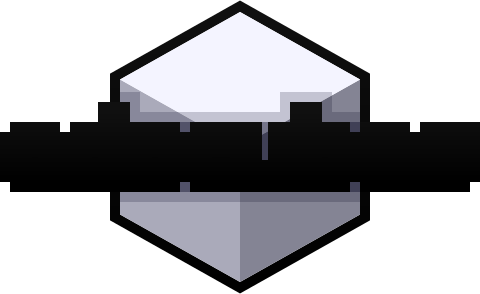
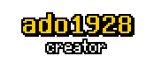
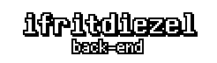
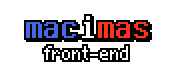

<p align=center></p>

<p align=center>3D sandbox game where you place and remove cubes</p>


<h2 align=center>setup</h2>

To get a server up running, make sure you've got these three:

- [Git](https://git-scm.com)
- [Node.js](https://nodejs.org) *(LTS or Current, doesn't matter)*
- npm *(or pnpm)*

Then, run the following:

```
git clone git@github.com:ado1928/ado-cubes.git
cd ado-cubes
npm install
npm run build
node .
```

<h2 align=center>contribution</h2>

> idk what to put here yet


<details>
<summary><h3>credits</h3></summary>

<h3 align=center>developers</h3>

<p align=center>
	<a href="https://github.com/ado1928"></a>
	<a href="https://github.com/ifritdiezel"></a>
	<a href="https://github.com/macimas"></a>
</p>

<h3 align=center>contributors</h3>

<table align=center>
	<tr>
		<td>hyxud</td>
		<td></td>
		<td align="center">Block placing with mouse</td>
	</tr>
</table>

<p align=center>Made with <a href="https://nodejs.org">Node.js</a>, <a href="https://threejs.org">Three.js</a>, and <a href="https://svelte.dev">Svelte</a>. Sounds generated with <a href="https://sfxr.me">jsfxr</a></p>
</details>

<br><br><br><br><br><br><br>

<p align=center><i>have a frog</i></p>