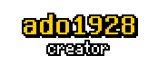
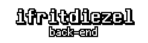
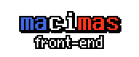

<p align=center></p>

<p align=center>3D sandbox game where you place and break cubes</p>


<h2 align=center>setup</h2>

Make sure you've got these three:

- A [computer](https://en.wikipedia.org/wiki/Computer)
- [Git](https://git-scm.com)
- [Node.js](https://nodejs.org) *(LTS or Current, doesn't matter)*
- npm *(or pnpm)*

Then, open up your terminal and run `git clone git@github.com:ado1928/ado-cubes.git` somewhere in your computer.

After it's done cloning the project, go into the `ado-cubes` folder and run the following:

```
npm install      # installs dependencies
npm run build    # builds the front-end
node .           # starts server
```

After starting the server, you should see something in your terminal similar to this:


Open up http://localhost:1928/ and check if it's working.

If it's all good, then congrats! You've earned it. :)

<h2 align=center>contribution</h2>

> idk what to put here atm

If you make changes in the `src` folder for client, make sure to run `npm run build`. If you need to make changes in a rapid pace, run `npm run dev` instead.


<h2 align="center">credits</h2>

<h3 align="center">developers</h3>

<p align=center>
	<a href="https://github.com/ado1928"></a>
	<a href="https://github.com/ifritdiezel"></a>
	<a href="https://github.com/macimas"></a>
</p>

<h3 align=center>contributors</h3>

<table align="center">
	<tr>
		<td align="center">
			<a href="https://github.com/hyxud.png">hyxud</a><br>
			Block placing with mouse
		</td>
		<td align="center">
			<a href="https://github.com/QmelZ.png">QmelZ</a><br>
			Settings
		</td>
	</tr>
</table>

<h3 align="center">made with</h3>
<table align="center">
	<tr>
		<td align="center">
			<br>
			<a href="https://threejs.org">Three.js</a><br>
			Game
		</td>
		<td align="center">
			<br>
			<a href="https://nodejs.org">Node.js</a><br>
			Back-End
		</td>
		<td align="center">
			<br>
			<a href="https://svelte.dev">Svelte</a><br>
			Front-End
		</td>
	</tr>
</table>

<br>

<p align="center">Sounds generated with <a href="https://sfxr.me">jsfxr</a></p>


<br><br><br><br><br><br><br>

<p align="center"><i>have a frog :D</i><br><br></p>