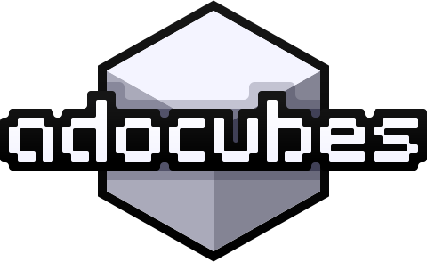

<p align=center></p>

<p align=center>3D sandbox game where you place and break cubes</p>


<h2 align=center>setup</h2>

To get a server up running, make sure you've got these three:

- [Git](https://git-scm.com)
- [Node.js](https://nodejs.org) *(LTS or Current, doesn't matter)*
- npm *(or pnpm)*

Then, run the following:

```
git clone git@github.com:ado1928/ado-cubes.git
cd ado-cubes
npm install
npm run build
node .
```

<h2 align=center>contribution</h2>

> idk what to put here yet


<h2 align="center">credits</h2>

<h3 align="center">developers</h3>

<p align=center>
	<a href="https://github.com/ado1928"></a>
	<a href="https://github.com/ifritdiezel"></a>
	<a href="https://github.com/macimas"></a>
</p>

<h3 align=center>contributors</h3>

<table align="center">
	<tr>
		<td align="center">
			<a href="https://github.com/hyxud.png">hyxud</a><br>
			Block placing with mouse
		</td>
		<td align="center">
			<a href="https://github.com/QmelZ.png">QmelZ</a><br>
			Settings
		</td>
	</tr>
</table>

<h3 align="center">made with</h3>
<table>
	<tr>
		<td align="center">
			<br>
			<a href="https://threejs.org">Three.js</a><br>
			Game
		</td>
		<td align="center">
			<br>
			<a href="https://nodejs.org">Node.js</a><br>
			Back-End
		</td>
		<td align="center">
			<br>
			<a href="https://svelte.dev">Svelte</a><br>
			Front-End
		</td>
	</tr>
</table>

<br>

Sounds generated with <a href="https://sfxr.me">jsfxr</a></p>


<br><br><br><br><br><br><br>

<p align="center""center"><i>have a frog</i></p>